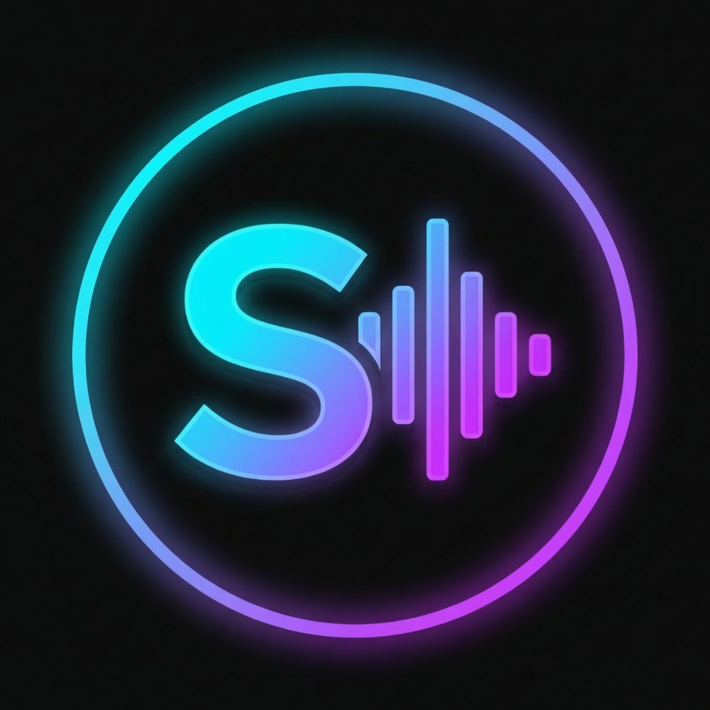
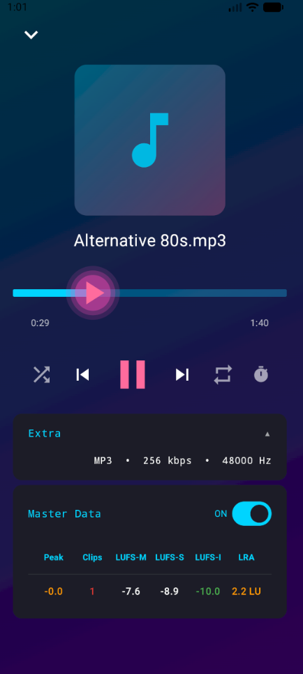
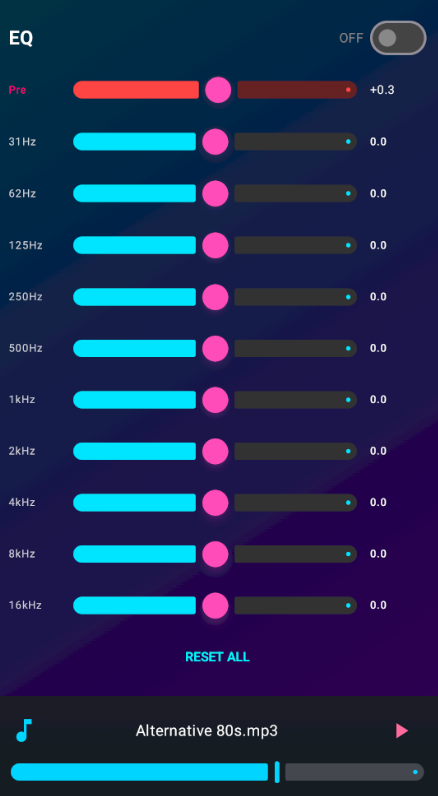
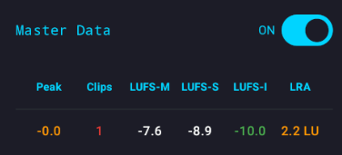

<p align="center">
  
</p>

<h1 align="center">Spoticious</h1>

<p align="center">
  <b>An Android music player for people who care about audio.</b>
</p>

---

Yeah, every player says that. But hear me out.

I've used a dozen music players. Respect to every dev who built one.
None had what I actually needed — so I built my own.

---

## Screenshots

| Player | Equalizer | Master Data |
|--------|-----------|-------------|
|  |  |  |

---

## What you get

**Master Data** — Per-track loudness analysis: LUFS-I, LRA, true peak, clip count.
ITU-R BS.1770-4 with K-weighting and gating. Same numbers you'd see after a render in Reaper.
Useful if you're a producer, vocalist, or just someone who gives a damn about levels.

**EQ** — 10-band graphic equalizer (31 Hz – 16 kHz) + preamp.
Band layout modeled after Audacious. Settings persist between sessions.
Too loud? Too quiet? Preamp handles it fast.

**Render / Export** — Apply your EQ and export the result.
AAC (up to 320 kbps) or WAV 24-bit, via MediaCodec.
No FFmpegKit — smaller APK, fine for FOSS stores.

**dBFS Meter** *(coming soon)* — Real-time digital output level meter.
Shows the actual signal level hitting your DAC.
Note: this is not a loudness simulator — streaming platforms normalize by LUFS
(YouTube ~−14 LUFS, Spotify ~−14 LUFS integrated, Apple ~−16 LUFS).
Use Master Data for that context. The meter shows what's happening on device.

**Wrapped** *(coming soon)* — Local listening stats. Spotify Wrapped vibes,
but fully offline. Your data stays on your phone.

---

## Stack


No FFmpegKit. No Play Services. Apache-friendly stack throughout.

---

## Install

> **Minimum: Android 7.0 (API 24)**

- **GitHub Releases** — grab the APK from [Releases](https://github.com/codestudio71/Code-Ai/releases)
- **F-Droid** — not listed yet, but the stack is compatible. Planned.

---

## Build
```bash
git clone https://github.com/codestudio71/Code-Ai.git
```
Open in Android Studio. Standard Gradle project, no special setup needed.
Requirements: Android Studio · JDK 17 · min SDK 24

---

## Known Issues

- dBFS meter is not implemented yet — coming in a future release
- Export on some devices may behave differently depending on MediaCodec implementation

Found a bug? Test it, then [open an issue](https://github.com/codestudio71/Code-Ai/issues) and let me know.

---

## Contributing

PRs are welcome. Open an issue first so we can discuss what you want to change.

---

## Hey, one more thing

If you have too much money and spend it on stupid stuff — consider donating instead.
I'm an indie dev, funding everything out of my own pocket. Staying FOSS, no paywalls, no bullshit.

[Donate via PayPal](https://www.paypal.com/donate/?hosted_button_id=H9DVM6NZ8TD6A)

No money? Spread the word. Share it with friends, forums, communities.
That kind of support means just as much.

Thanks.

---

## License

Apache 2.0 — see [LICENSE](LICENSE).
